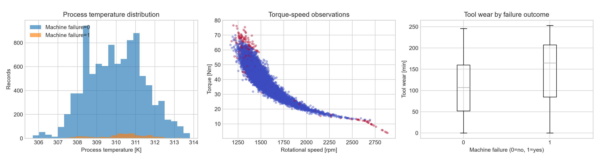
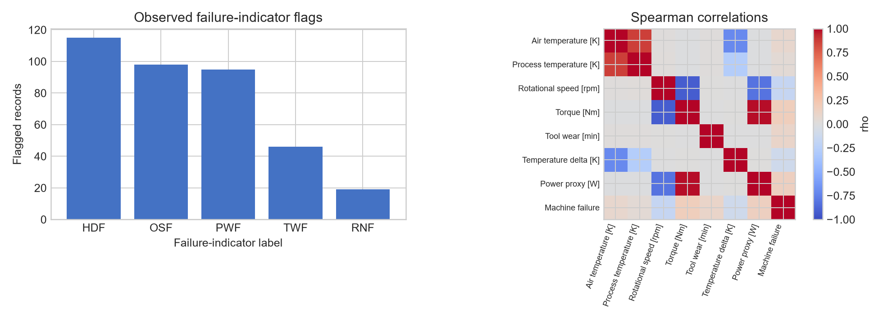

# Equipment Fault Diagnosis & Reliability Analysis

Reproducible Python engineering analysis using the [UCI AI4I 2020 Predictive Maintenance Dataset](https://archive.ics.uci.edu/dataset/601/ai4i+2020+predictive+maintenance+dataset). It demonstrates data validation, interpretable failure-pattern analysis, statistical diagnostics, a leakage-aware baseline classifier, and verification-oriented RCA/FMEA documentation. See [`data/DATA_SOURCE.md`](data/DATA_SOURCE.md) for provenance, licensing and a documented source-text/count discrepancy.

## Engineering motivation

The workflow is designed as a portfolio project for equipment/process engineering applications. It demonstrates transferable engineering habits: validate signals before acting, distinguish association from root cause, prioritize physical verification, and document uncertainty. The dataset is **synthetic industrial data, not semiconductor equipment data**.

## Main results

Run the pipeline to regenerate all reported results from the official CSV. The generated report records the observed rates, confidence intervals, group comparisons, model precision/recall/F1/average precision, figures, and limitations. No improvement in uptime, yield, downtime, or reliability is claimed.

## Methodology

1. Validate schema, missingness, duplicates, basic physical ranges, and class balance.
2. Profile the observed per-record machine-failure proportion, individual indicator frequency/overlap, operating-condition distributions, and parameter bands. This is not an equipment reliability rate, MTBF, hazard rate, uptime, or yield metric.
3. Run Spearman correlations, Welch group comparisons with Cohen's d, and a stratified logistic-regression baseline.
4. Exclude identifiers, target, and failure-mode flags from model predictors to prevent leakage; retain derived power proxy for EDA only to avoid redundant deterministic model inputs.
5. Create an RCA/FMEA review register that requires engineering verification before a cause or action is accepted.

## Repository structure

```text
equipment-fault-diagnosis/
├── data/{raw,processed}/       # source (ignored) and generated tables
├── notebooks/                  # three documented analyses
├── reports/{figures,...}       # engineering report, FMEA, figures
├── src/                        # modular pipeline
├── tests/                      # Pytest checks
├── requirements.txt
├── LICENSE                      # MIT license for project code
└── README.md
```

## Installation and reproduction

```powershell
py -3.11 -m venv .venv
.\.venv\Scripts\Activate.ps1
python -m pip install -r requirements.txt
python -c "import sys; sys.path.append('src'); from data_loader import download_data; download_data()"
python src/run_analysis.py
$env:PYTHONPATH = 'src'; pytest -q
```

Outputs: `reports/engineering_report.md`, `reports/rca_fmea.md`, `reports/figures/`, and `data/processed/`.

## Dataset dictionary

| Field | Meaning / unit | Used as predictor? |
| --- | --- | --- |
| UDI, Product ID | Record identifiers | No |
| Type | Product quality category | Yes |
| Air / Process temperature | Kelvin | Yes |
| Rotational speed | rpm | Yes |
| Torque | Nm | Yes |
| Tool wear | minutes | Yes |
| Machine failure | Binary outcome | Target only |
| TWF, HDF, PWF, OSF, RNF | Dataset failure-indicator columns | No - descriptive/RCA only |

## Limitations

- The CSV has no explicit timestamps, maintenance histories, downtime, or wafer-process measurements. UCI categorizes the source as time-series, but UDI is used only as an identifier here.
- Associations and model metrics do not prove physical mechanisms or real-equipment performance. The fixed 0.50 model threshold is exploratory, not a deployment threshold.
- Failure-indicator columns can overlap and must not be treated as exclusive classes. The current official CSV also has a documented RNF/target inconsistency; see `data/DATA_SOURCE.md`.
- SPC is a future-methodology extension only; no control chart is produced without valid temporal/subgroup assumptions.

The same careful workflow can transfer to semiconductor equipment engineering, where it would require asset-specific sensor validation, maintenance context, configuration control, and qualified engineering review.

## Selected figures





## Attribution

Matzka, S. (2020). *AI4I 2020 Predictive Maintenance Dataset*. UCI Machine Learning Repository. https://doi.org/10.24432/C5HS5C. The source data are CC BY 4.0; this repository does not redistribute the raw CSV. Project code is MIT-licensed. See [`CITATION.cff`](CITATION.cff) and [`data/DATA_SOURCE.md`](data/DATA_SOURCE.md).
